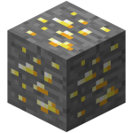

# Game - Collect blocks

[Anleitung auf Deutsch](../../games/collect-blocks/README_DE.md)

Possible walkthrough for working with kids:

* Run the 'helloWorld' to see how it works.
* Set first blocks programmatically.
* _Reset the player on start to defined coordinates._
* Introduce the concept of a while-loop.
* Poll the block hit events and print them to see what happens.
* _Set world immutable to avoid destroying the world without a hit event triggered
(hit event only by sword with right mouse button)_
* Introduce the concept of a for-in-loop.
* Introduce the concept of a if-conditions.
* Only print something if a specific block-type was hit.
* Add concept of points.

_These are optional_

